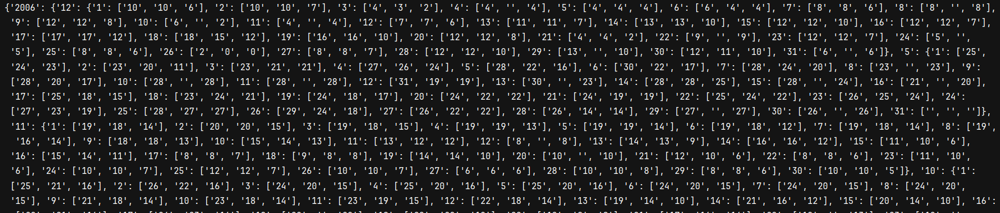

## Weather Man 
A CLI based program that returns the weather of Muree, Pakistan on a said day.

### The Problem

Given a dataset of weather readings of Muree, Pakistan:

- Read the dataset & parse it.
- Store the data in an appropriate data structure
- Write a program that accepts a time, and return the corresponding weather reading.

### The Solution

We will be storing the weather readings in the following format:

```
weather = {
        'year': {
            'month': {
                'day': ['max_temp', 'mean_temp', 'min_temp']
            }
        }
    }
```


### Output of data structure after operation

