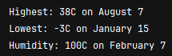
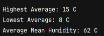
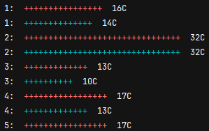

# Weather Man 
A CLI based program that returns the weather of a said day.

### The Problem

Given a dataset of weather readings of Muree, Pakistan:

- Read the dataset & parse it.
- Store the data in an appropriate data structure
- Write a program that accepts a time, and return the corresponding weather reading.

### The Solution

We will be storing the weather readings in the following format:

```
weather = {
        'year': {
            'month': {
                'day': ['max_temp', 'mean_temp', 'min_temp']
            }
        }
    }
```


## Screenshots
### Given an year, return the days where the temperature was:
#### - The highest
#### - The lowest
#### - The most humid


### Given a date, return the **_**average**_** temperature was:
#### - The highest
#### - The lowest
#### - The most humid


### Given a date, draw two horizontal bar charts for days with:
#### - The highest temperature ( In red )
#### - The lowest temperature ( In blue)
